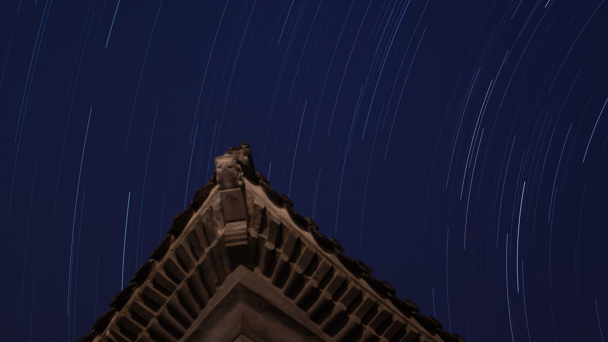
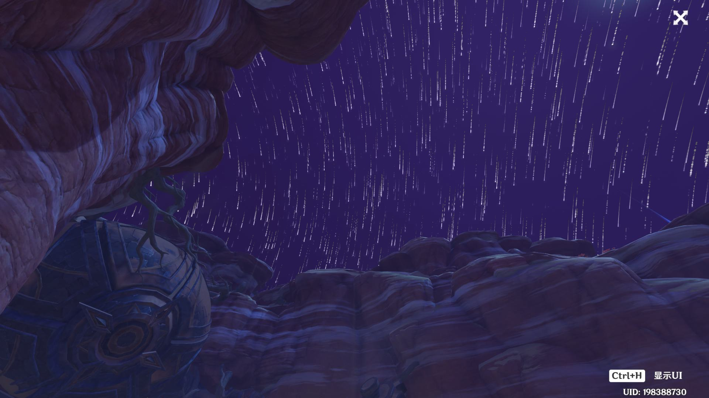

# AutoStarTrail - 自动星轨处理

> 可替代 Photoshop 快速生成星轨图片，或替代 Premiere 快速生成星轨拖尾视频。

本 Fork 版本移除了 GUI，使其方便在命令行中使用，同时便于制作成镜像使用。

### Usage

```bash
# 创建虚拟环境
$ python3 -m venv venv

# 激活虚拟环境
$ source venv/bin/activate

# 安装依赖
$ pip3 install -r requirements.txt 
```

全拖尾，衰减值为 `1.0`，输出为图片：

```bash
$ python3 main.py -i ./input -o ./output -d 1.0 -m image
```

部分拖尾，衰减值为 0.993：

```bash
$ python3 main.py -i ./input -o ./output -d 0.993 -m image
```

### ImageDemo

全拖尾，衰减值为1.0：



部分拖尾，衰减值为0.993：



### Acknowledgments

- [StarTrail](https://github.com/vvvvsv/AutoStarTrail)
